# Sistema de Reservas de Vuelos — Pipes & Filters

Sistema de procesamiento de reservas de vuelos implementado con el patrón arquitectónico **Pipes & Filters**. Cada reserva atraviesa una cadena fija de 7 filtros (validaciones de negocio + enriquecimiento con tipo de cambio + cálculo de precio) que van transformando un contexto inmutable, acumulando errores/warnings y una traza de ejecución, hasta producir un resultado final con el precio total en USD y en la moneda local del destino.

Node.js + TypeScript (modo `strict`) + Express + Zod. Sin base de datos: los pasajeros y vuelos son datos mock en memoria (`data/`).

**Equipo — Grupo 1:**
- Guillermo Golpe
- Martina Rebellato
- Matias Piñeyro
- Pilar Fraschini
- Tomas Hazan
- Roman Ferrero

## Índice

- [Metodología de trabajo](#metodología-de-trabajo)
- [Diagrama del pipeline](#diagrama-del-pipeline)
- [Requisitos](#requisitos)
- [Instalación y ejecución](#instalación-y-ejecución)
- [Variables de entorno](#variables-de-entorno)
- [Scripts disponibles](#scripts-disponibles)
- [Endpoints](#endpoints)
- [Formato de la respuesta de una reserva](#formato-de-la-respuesta-de-una-reserva)
- [Configuración del pipeline](#configuración-del-pipeline)
- [Comportamiento de la API de tipo de cambio](#comportamiento-de-la-api-de-tipo-de-cambio)
- [Datos mock disponibles](#datos-mock-disponibles)
- [Casos de la letra → tests](#casos-de-la-letra--tests)
- [Colección de Postman](#colección-de-postman)
- [Estructura del proyecto](#estructura-del-proyecto)
- [Documentación adicional](#documentación-adicional)

## Metodología de trabajo

El proyecto se construyó con Claude Code, en dos etapas con un modelo distinto en cada una:

1. **Planificación (Plan Mode) — Claude Opus 5, razonamiento *High*.** A partir de la letra del ejercicio se diseñó el plan completo de implementación (`IMPLEMENTATION_PLAN.md`, 41 tickets agrupados en fases, con dependencias, criterios de aceptación y una tabla de "olas" de paralelización) y la plantilla de decisiones de diseño (`DESIGN_DECISIONS.md`).
2. **Implementación — Claude Sonnet 5, razonamiento *High*.** Se ejecutó el plan ticket por ticket, verificando build/lint/tests y completando las notas de implementación de cada uno a medida que se cerraba.

**Cambio de ritmo durante la implementación:** procesar los 41 tickets uno por uno, con una pausa y verificación completa después de cada uno, resultó demasiado lento. A partir de `TICKET-13` (ya con `TICKET-01`–`TICKET-12` cerrados) se tomaron dos decisiones para acelerar sin resignar calidad, documentadas en detalle en la **"Nota de replanificación"** dentro de `IMPLEMENTATION_PLAN.md` (justo antes de la Fase 3):

- **Tests solo donde importan.** De ahí en más, solo llevan suite unitaria dedicada el núcleo del pipeline (los 7 filtros, el runner, `PipelineFactory`, `ReservationContextLoader`) y el soporte del filtro de tipo de cambio (cache, retry, provider HTTP, servicio) — porque ahí vive la lógica de negocio y porque la letra pide casos concretos de timeout/retry/cache/fallback. El resto del código (schemas, mappers, stores, servicios de aplicación, capa HTTP completa) se implementó sin tests unitarios propios, verificado con `build`+`lint` y cubierto igualmente por los 16 tests de integración obligatorios de la letra (que ejercitan la app HTTP completa de punta a punta).
- **Trabajo por sesiones, no ticket por ticket.** Los tickets restantes (`TICKET-13` a `TICKET-41`) se agruparon en **7 sesiones de trabajo** (filtros de validación · filtros de precio · integración de tipo de cambio · ensamblado + capa de aplicación · capa HTTP · tests de integración de la letra · entregables finales). Cada ticket individual se sigue marcando `[x]` con sus notas propias para mantener la trazabilidad, pero se implementa y verifica en bloque por sesión en vez de pausar después de cada uno. El detalle completo de qué tickets entran en cada sesión está en esa misma nota de `IMPLEMENTATION_PLAN.md`.

Además, después de cerrar la Sesión 6 se corrió una revisión de código (`code-review`, multi-agente) sobre todo lo implementado hasta ese punto, que encontró y permitió corregir un bug real antes de seguir (ver la nota de TICKET-37 y la sección "Retry, timeout y cache" de `DESIGN_DECISIONS.md`).

## Diagrama del pipeline

El orden de los filtros es **fijo** (no configurable, solo se puede habilitar/deshabilitar cada uno — ver [Configuración del pipeline](#configuración-del-pipeline)):

```mermaid
flowchart LR
    Loader["ReservationContextLoader\n(fuente: carga pasajero + vuelo)"] --> F1
    F1["F1 · PassengerValidation"] --> F2
    F2["F2 · FlightValidation"] --> F3
    F3["F3 · ExchangeRate\n(detecta moneda destino + tasa)"] --> F4
    F4["F4 · BasePrice\n(precio × multiplicador de clase)"] --> F5
    F5["F5 · LoyaltyDiscount"] --> F6
    F6["F6 · PassengerTypeAdjustment"] --> F7
    F7["F7 · TaxesAndFees\n(impuestos + combustible + tasa aeropuerto)"] --> Mapper
    Mapper["ReservationResultMapper\n(status, redondeo, totalLocal)"] --> Result(("ReservationResult"))
```



Si un filtro de validación (F1/F2) encuentra un error, el contexto queda `halted` y los filtros restantes quedan marcados como `skipped` en la traza — la reserva nunca sigue calculando precio sobre datos inválidos. Un fallo de la API de tipo de cambio (F3) **no** detiene el pipeline: usa una tasa de fallback y agrega un warning. Una excepción inesperada o datos corruptos en cualquier filtro se capturan en el runner (`Pipeline`) y nunca se propagan hacia el llamador.

## Requisitos

- Node.js ≥ 18 (desarrollado y probado con Node 24).
- npm (viene con Node).
- No requiere base de datos ni servicios externos para correr los tests (usan siempre stubs/fakes). El servidor real sí llama a una API pública de tipo de cambio si no se configura lo contrario (ver [variables de entorno](#variables-de-entorno)).

## Instalación y ejecución

```bash
npm install
npm run build      # compila a dist/
npm run dev        # levanta el servidor en modo watch (tsx), puerto 3000 por defecto
# o, ya compilado:
npm start
```

Con el servidor corriendo, probar por ejemplo:

```bash
curl http://localhost:3000/pipeline/config
```

## Variables de entorno

Copiar `.env.example` a `.env` si se quiere personalizar algo (todas tienen default):

| Variable | Default | Descripción |
|---|---|---|
| `PORT` | `3000` | Puerto HTTP del servidor. |
| `EXCHANGE_API_BASE_URL` | `https://api.exchangerate-api.com/v4/latest` | Base URL de la API de tipo de cambio. El provider hace `GET {EXCHANGE_API_BASE_URL}/USD`. |
| `LOG_LEVEL` | `info` | `debug` \| `info` \| `warn` \| `error`. |

## Scripts disponibles

| Script | Qué hace |
|---|---|
| `npm run build` | Compila TypeScript a `dist/` (`tsconfig.build.json`, excluye tests). |
| `npm run dev` | Levanta el servidor con recarga automática (`tsx watch`). |
| `npm start` | Corre el build ya compilado (`dist/server.js`). |
| `npm test` | Corre toda la suite de Jest. |
| `npm run test:watch` | Jest en modo watch. |
| `npm run test:coverage` | Jest con reporte de cobertura. |
| `npm run lint` | ESLint sobre todo el proyecto. |

> Nota: los scripts de test invocan Jest con `node --max-old-space-size=4096 node_modules/jest/bin/jest.js` en vez de `jest` directo — en algunos entornos, correr Jest con el límite de memoria por defecto y varios workers en paralelo puede quedarse sin memoria; con un heap más grande corre estable.

## Endpoints

Todos los endpoints devuelven JSON. Los errores tienen el formato uniforme `{ "error": { "code", "message", "details"? } }`.

### `POST /reservations/process`

Procesa un lote de reservas de forma sincrónica. Cada ítem se valida y procesa de forma independiente (un ítem inválido o fallido no afecta a los demás).

**Request:**

```json
{
  "reservations": [
    { "id": "R1", "passengerId": "PAX-001", "flightCode": "AA001", "origin": "MIA", "destination": "JFK", "seatClass": "economy" }
  ],
  "config": { "loyaltyDiscount": { "enabled": false } }
}
```

- `reservations`: array no vacío (obligatorio). Un body sin `reservations` (o vacío) → `400`.
- `config`: opcional, override parcial de la configuración del pipeline **solo para este request** (no persiste).

**Response `200`:**

```json
{
  "results": [
    {
      "reservationId": "R1",
      "status": "COMPLETED",
      "errors": [],
      "warnings": [],
      "pricing": {
        "flightBasePriceUSD": 200, "classBasePriceUSD": 200, "currentPriceUSD": 200,
        "loyaltyDiscountUSD": 0, "passengerTypeDiscountUSD": 0, "subtotalUSD": 200,
        "taxesUSD": 24, "fuelSurchargeUSD": 16, "airportFeeUSD": 25, "totalUSD": 265
      },
      "exchange": {
        "baseCurrency": "USD", "targetCurrency": "USD", "rate": 1, "source": "api",
        "retrievedAt": "2024-01-01T00:00:00.000Z", "originalPrice": 200, "convertedPrice": 200
      },
      "totalLocal": { "currency": "USD", "amount": 265 },
      "trace": [
        { "filter": "PassengerValidation", "status": "ok", "durationMs": 0 },
        { "filter": "FlightValidation", "status": "ok", "durationMs": 0 },
        { "filter": "ExchangeRate", "status": "ok", "durationMs": 0 },
        { "filter": "BasePrice", "status": "ok", "durationMs": 0 },
        { "filter": "LoyaltyDiscount", "status": "ok", "durationMs": 0 },
        { "filter": "PassengerTypeAdjustment", "status": "ok", "durationMs": 0 },
        { "filter": "TaxesAndFees", "status": "ok", "durationMs": 0 }
      ]
    }
  ],
  "summary": { "total": 1, "completed": 1, "completedWithWarnings": 0, "rejected": 0, "failed": 0 },
  "totalProcessingTimeMs": 2
}
```

Un ítem malformado (le faltan campos, `seatClass` inválido, etc.) no pasa por el pipeline: queda directamente `REJECTED` con `errors` describiendo cada campo inválido, y **no** se guarda en el store de estado (no tiene un `id` de reserva confiable para consultarlo después salvo que el `id` recibido sea válido).

### `GET /reservations/:id/status`

Devuelve el último resultado guardado para una reserva ya procesada (mismo `id` enviado en el POST).

**Response `200`:**

```json
{
  "id": "R1",
  "status": "COMPLETED",
  "updatedAt": "2024-01-01T00:00:00.000Z",
  "result": { "...": "mismo objeto que en results[] del POST" }
}
```

**Response `404`** si el `id` nunca fue procesado:

```json
{ "error": { "code": "NOT_FOUND", "message": "No reservation found with id X" } }
```

### `GET /pipeline/config`

Devuelve la configuración actual del pipeline (solo lectura).

### `PUT /pipeline/config`

Actualiza la configuración global (persiste para los próximos requests, hasta que el proceso se reinicie). Acepta un objeto parcial; valida con Zod (rechaza `timeoutMs > 5000`, `maxAttempts` fuera de 1–3, porcentajes fuera de `[0,1]`, montos negativos y claves desconocidas) → `400` si es inválido, sin modificar la config.

```bash
curl -X PUT http://localhost:3000/pipeline/config \
  -H "Content-Type: application/json" \
  -d '{"taxesAndFees":{"taxRate":0.15}}'
```

### `DELETE /exchange-rates/cache`

Endpoint **adicional** (no es uno de los 4 principales de la letra, cubre la funcionalidad opcional "invalidación manual de cache"). Fuerza que la próxima consulta de tipo de cambio vuelva a llamar a la API externa. Responde `204` sin body.

## Formato de la respuesta de una reserva

| Campo | Descripción |
|---|---|
| `status` | `COMPLETED` \| `COMPLETED_WITH_WARNINGS` \| `REJECTED` \| `FAILED` (ver abajo). |
| `errors` / `warnings` | `{ severity, code, message, filter? }`. Un `error` implica que el pipeline se detuvo en ese filtro. |
| `pricing` | Desglose en USD, redondeado a 2 decimales en la respuesta (los cálculos internos usan precisión completa). |
| `exchange` | Metadata de la conversión de moneda (si F3 estaba habilitado): moneda origen/destino, tasa, `source`, precio original y convertido. |
| `totalLocal` | `{ currency, amount }`: el `totalUSD` convertido a la moneda del destino con la tasa de `exchange`. Ausente si F3 estaba deshabilitado. |
| `trace` | Un paso por filtro, con `status`: `ok` \| `disabled` \| `skipped` \| `failed`, y `durationMs`. |

**Status:**
- `COMPLETED`: sin errores ni warnings.
- `COMPLETED_WITH_WARNINGS`: sin errores, pero con al menos un warning (típicamente, fallback de tipo de cambio).
- `REJECTED`: una validación de negocio (F1/F2) o el body de la reserva no pasó la validación de formato.
- `FAILED`: una excepción inesperada (`FILTER_EXCEPTION`) o datos corruptos (`CORRUPT_CONTEXT`, p. ej. un precio `NaN`).

## Configuración del pipeline

`GET /pipeline/config` devuelve, por defecto:

| Filtro | Parámetro | Default |
|---|---|---|
| F4 BasePrice | multiplicadores | economy `1`, business `2.5`, first `4` |
| F5 LoyaltyDiscount | descuentos | none `0`, bronze `5%`, silver `10%`, gold `15%` |
| F6 PassengerTypeAdjustment | descuentos | child `25%`, adult `0%`, senior `15%` |
| F7 TaxesAndFees | `taxRate` / `airportFeeUSD` / `fuelSurchargeRate` | `12%` / `$25` / `8%` |
| F3 ExchangeRate | `timeoutMs` / `maxAttempts` / `retryDelayMs` / `cacheTtlMs` | `5000` / `3` / `100` / `3600000` (1h) |
| F3 ExchangeRate | `fallbackRates` | `{ ARS: 1000, BRL: 5.4, EUR: 0.92, CLP: 950, UYU: 40, MXN: 18 }` (sin JPY, a propósito) |

Cada filtro tiene además un flag `enabled`. El **orden** de los 7 filtros es fijo en código (`PipelineFactory`); la configuración solo habilita/deshabilita y parametriza (ver `DESIGN_DECISIONS.md`, D11).

## Comportamiento de la API de tipo de cambio

- **Timeout**: `timeoutMs` por intento (no acumulado), vía `AbortSignal.timeout`.
- **Reintentos**: hasta `maxAttempts` intentos totales, con backoff lineal corto (`retryDelayMs × intento`).
- **Cache**: las tasas (base USD) se cachean en memoria por `cacheTtlMs`. Llamadas concurrentes a una tasa no cacheada comparten una única promesa en curso (single-flight): no se dispara más de una llamada simultánea a la API externa por ese motivo.
- **Fallback**: si se agotan los intentos, se usa `fallbackRates[moneda]`; si la moneda no está en la tabla, se usa USD (tasa `1`). En ambos casos se agrega el warning `EXCHANGE_RATE_FALLBACK`, nunca un error — la reserva sigue procesándose.
- Todos estos parámetros son configurables globalmente (`PUT /pipeline/config`) o por request (`config` en el body del POST), y **sí** tienen efecto real sobre el próximo intento de conexión, incluida la moneda del destino — el servicio de tipo de cambio es un singleton (comparte cache entre requests) pero recibe estos parámetros en cada llamada, no una sola vez al arrancar.

## Datos mock disponibles

### Pasajeros (`data/mockPassengers.ts`)

| id | Tipo | Tier | País | Activo | Escenario |
|---|---|---|---|---|---|
| `PAX-001` | adult (35) | none | AR | sí | Caso base / B1 / P1 |
| `PAX-002` | adult (40) | gold | BR | sí | P2 (descuento lealtad) |
| `PAX-003` | child (8) | gold | AR | sí | P3 (descuento combinado) |
| `PAX-004` | senior (70) | silver | ES | sí | P4 (descuento combinado + EUR) |
| `PAX-005` | adult | bronze | US | **no** | Pasajero inactivo |
| `PAX-006` | adult | none | CL | sí | Email inválido |
| `PAX-007` | adult | none | UY | sí | Nombre vacío |
| `PAX-008` | child (30, real) | none | AR | sí | Desajuste tipo/edad |
| `PAX-009` | adult (45) | bronze | US | sí | Caso feliz adicional |
| `PAX-010` | adult (50) | silver | MX | sí | Caso feliz adicional |

### Vuelos (`data/mockFlights.ts`)

| code | Ruta | Destino | Base USD | Asientos | Escenario |
|---|---|---|---|---|---|
| `AA001` | MIA→JFK | US | 200 | 50 | B1/P1/P2, sin conversión |
| `LA4567` | SCL→EZE | AR | 150 | 20 | C1 (ARS) |
| `AR1300` | EZE→GRU | BR | 100 | 10 | P3, C2 (BRL) |
| `IB6844` | EZE→MAD | ES | 800 | **2** | P4, C2 (EUR) |
| `LA8070` | GRU→SCL | CL | 300 | **0** | B3 (sin asientos) |
| `AA900` | JFK→EZE | AR | 700 | 30 | Vuelo en el pasado |
| `JL005` | JFK→HND | JP | 1000 | 15 | C3 (JPY fuera de `fallbackRates` → `fallback-usd`) |

## Casos de la letra → tests

| Caso | Descripción | Test |
|---|---|---|
| B1 | Flujo básico válido | `tests/integration/letter.basic-and-pricing.test.ts` |
| B2 | Pasajero inexistente | `tests/integration/letter.basic-and-pricing.test.ts` |
| B3 | Vuelo sin asientos | `tests/integration/letter.basic-and-pricing.test.ts` |
| B4 | Ítem malformado en un lote | `tests/integration/letter.basic-and-pricing.test.ts` |
| P1–P4 | Cálculo de precios | `tests/integration/letter.basic-and-pricing.test.ts` |
| C1 | Conversión a ARS | `tests/integration/letter.exchange-and-errors.test.ts` |
| C2 | Conversión a BRL y EUR en un lote | `tests/integration/letter.exchange-and-errors.test.ts` |
| C3 | Fallback de tipo de cambio | `tests/integration/letter.exchange-and-errors.test.ts` |
| C4 | Cache de tasas (hit / miss por TTL) | `tests/integration/letter.exchange-and-errors.test.ts` |
| R1 | Timeout de la API de cambio | `tests/integration/letter.exchange-and-errors.test.ts` |
| R2 | Excepción inesperada en el servicio de cambio | `tests/integration/letter.exchange-and-errors.test.ts` |
| R3 | Error de red de la API de cambio | `tests/integration/letter.exchange-and-errors.test.ts` |
| R4 | Datos corruptos (`basePriceUSD: NaN`) | `tests/integration/letter.exchange-and-errors.test.ts` |

Además, cada filtro y servicio del núcleo del pipeline tiene su propia suite unitaria en `tests/unit/` (ver `IMPLEMENTATION_PLAN.md` para el detalle ticket por ticket y la nota de replanificación sobre el alcance de los tests).

## Colección de Postman

`postman/MTA-Grupo1-Ejercicio1.postman_collection.json` — colección v2.1 con variable `baseUrl` (default `http://localhost:3000`), 4 carpetas (*Reservas*, *Estado*, *Configuración*, *Cache*) y 17 requests, cada uno con un ejemplo de response real y un test de status code.

1. Levantar el servidor: `npm run dev`.
2. Importar el archivo en Postman (`File → Import`).
3. Correr requests individuales, o toda la colección con el **Collection Runner** (`Run collection`) — el orden de las carpetas importa: *Reservas* crea la reserva que después consulta *Estado*.

## Estructura del proyecto

```
data/                       mocks de pasajeros y vuelos
src/
  config/                   env, tipos/defaults de config del pipeline
  domain/                   tipos de dominio + funciones puras (edad, moneda por país)
  pipeline/                 Filter, ReservationContext, Pipeline (runner), PipelineFactory,
                             ReservationContextLoader, ReservationResultMapper
  filters/                  los 7 filtros (F1–F7)
  services/                 casos de uso de aplicación (procesamiento de lote, config, status)
    exchange/                 cache, retry, provider HTTP y servicio de tipo de cambio
  repositories/             acceso a los mocks (pasajeros, vuelos)
  http/                     controllers, routes, schemas Zod, middlewares
  shared/                   Logger, Clock, money, dates, errores
  app.ts / server.ts / container.ts   Express app, entrypoint y composition root
tests/
  unit/                     tests del núcleo del pipeline (filtros, runner, exchange, config)
  integration/              tests end-to-end de los casos de la letra
  helpers/                  builders, fakes y utilidades de test
postman/                    colección de Postman
```

## Documentación adicional

- [`DESIGN_DECISIONS.md`](./DESIGN_DECISIONS.md): decisiones de diseño (D1–D13 y menores), con problema/alternativas/motivo/consecuencias, e interpretaciones de la letra.
- [`IMPLEMENTATION_PLAN.md`](./IMPLEMENTATION_PLAN.md): seguimiento ticket por ticket de la implementación, con notas de cada uno.
